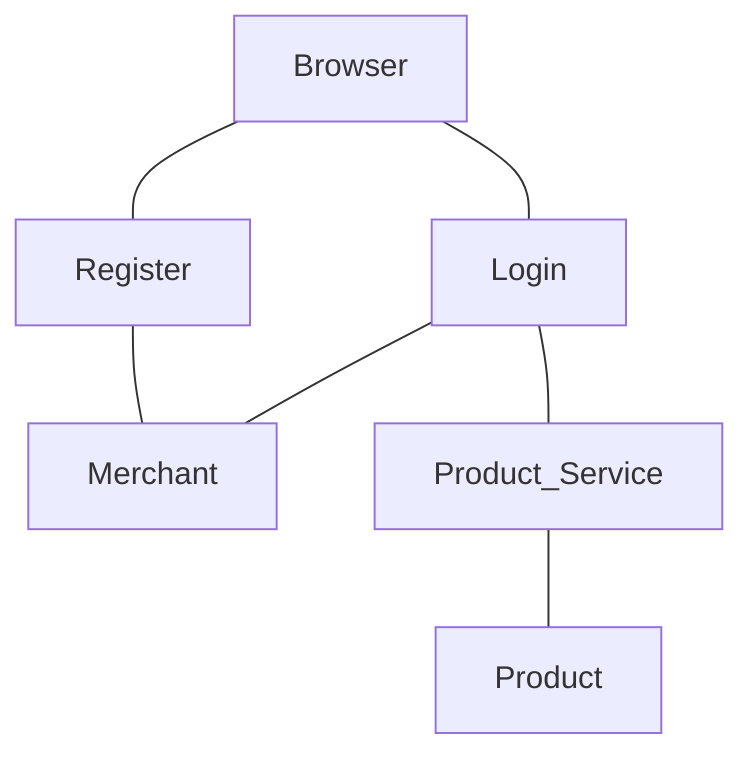

# Project E-Commerce API

repositori ini terdapat kode dan dokumentasi mengenasi E-Commerce API.

###### konten

- Ringkasan
- Autentikasi
- Sumber
- Alur Diagram
- Entity Relationship Diagram

## 1. Ringkasan

Mini project API back-end E-Commerce menggunakanan database mysql, mengubah password dengan bcrypt dan mengbuat token dengan JSON web token.

## 2. Autentikasi

Menginput, mengubah, maupun menghapus suatu product dengan akses token sebagai persyaratan dalam prosesnya.

## 3. Sumber

Permintaan dilakukan dengan persyaratan akses token, berawal dari login dalam meminta sebuah token. Sebelumnya 

## 4. Alur Diagram



## 5. Entity Relationship Diagram

```
A[
[Merchant]
id
name
password
address
phone_number
join_date]---
B[
[Product]
id
name
quantity
price]

```


library yang digunakan dalam membuat back-end:
- express
- sequelize
- sequelize-cli
- mysql2
- bcrypt
- jsonwebtoken
- joi
- moment
- nodemon

terdiri dari 2 database yang digunakan:
- merchant
    - id:
    - name:
    - password:
    - address:
    - join_date:
    - phone_number:

- product
    - id:
    - name:
    - quantity:
    - price:

folder dan file yang dibuat:

- mini-project-backend (folder)
    - app (folder)
        - controller (folder)
            - login.controller.js (js file)
            - product.controller.js (js file)
            - register.controller.js (js file)
        - middlewares (folder)
            - auth.middleware.js (js file)
        - routes (folder)
            - index.js (js file)
        - validation.js (js file)
            -validation.js (js file)
        - view (folder)
    - app.js (js file)